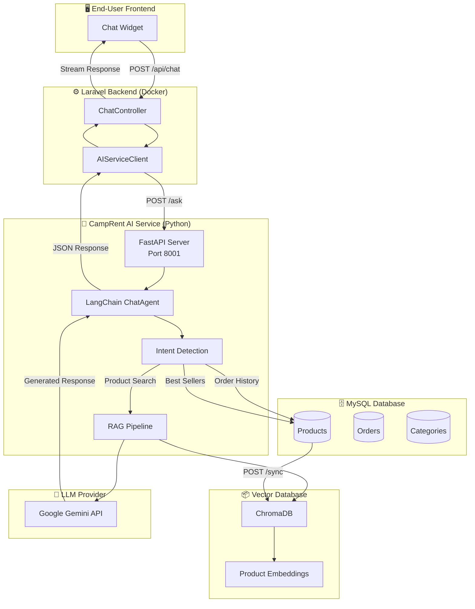
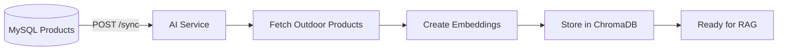

# CampRent AI Chatbot Service - Architecture Overview

## Kiến trúc hệ thống

Hệ thống chatbot AI của CampRent sử dụng kiến trúc **RAG (Retrieval-Augmented Generation)** với FastAPI + LangChain + ChromaDB để tư vấn sản phẩm outdoor cho thuê.

---

## Chat Agent Modes

CampRent AI Service hỗ trợ 2 chế độ xử lý chat:

### 1. Smart Agent (Text-to-SQL) - Mặc định

LLM tự động quyết định chiến lược xử lý dựa trên câu hỏi khách hàng.

**Ví dụ queries:**
- "Lều nào rẻ nhất?" → SQL: `ORDER BY price ASC LIMIT 1`
- "Có bao nhiêu ba lô?" → SQL: `SELECT COUNT(*) WHERE category = 'Ba lô'`
- "Đồ cắm trại cho 4 người" → Vector: semantic search
- "Đơn thuê #5 của tôi" → SQL: `WHERE id = 5 AND user_id = ...`

### 2. Rule-based Agent (Legacy)

Dùng regex để detect intent, chạy nhanh hơn nhưng hạn chế.

| Intent | Trigger Keywords | Data Source |
|--------|-----------------|-------------|
| `product_search` | (default) | ChromaDB Vector Search |
| `order_history` | "đơn thuê", "lịch sử" | MySQL Orders |
| `best_sellers` | "hot", "phổ biến" | MySQL Aggregation |
| `check_stock` | "còn hàng", "tồn kho" | MySQL Products |

---

## Data Sync Flow

---

*Đồ án IS207.Q22 — CampRent — GVHD: ThS. Vũ Minh Sang*
